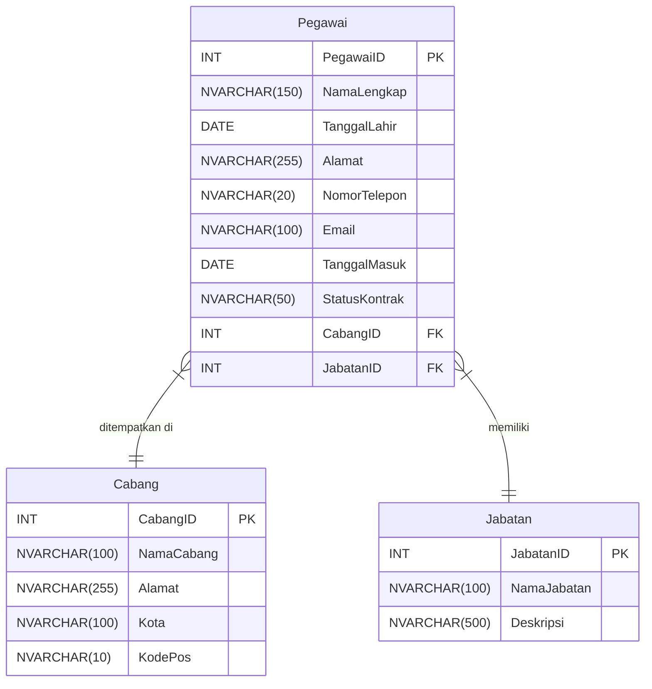

# Database Schema Documentation

This document provides a detailed overview of the database schema for the CompanySolution project.

## 1. Entity-Relationship Diagram (ERD)

The following diagram illustrates the relationships between the tables in the database.

## 2. Table Descriptions & Relationships

### Cabang
- **Description**: Stores information about all company branches.
- **Primary Key**: `CabangID`

### Jabatan
- **Description**: Stores information about available job positions within the company.
- **Primary Key**: `JabatanID`

### Pegawai
- **Description**: The central table, storing detailed information about each employee.
- **Primary Key**: `PegawaiID`
- **Foreign Keys**:
    - `CabangID`: References `Cabang(CabangID)` to associate an employee with a specific branch.
    - `JabatanID`: References `Jabatan(JabatanID)` to assign a job position to an employee.

## 3. Business Rules

- An employee must be assigned to a valid branch (`CabangID`).
- An employee must be assigned a valid job position (`JabatanID`).
- The `Email` for each employee must be unique.
- `NamaLengkap` and `TanggalMasuk` are mandatory fields for every employee record.
